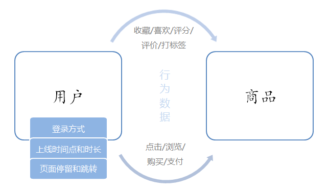

# Data-Warehouse-Flink
基于Flink对用户行为数据的实时分析

### 1.电商用户行为
电商用户行为数据多样，整体可以分为用户行为习惯数据和业务行为数据两大类。
用户的行为习惯数据包括了用户的登录方式、上线的时间点及时长、点击和浏览页面、页面停留时间以及页面跳转等等，我们可以从中进行流量统计和热门商品的统计，也可以深入挖掘用户的特征；这些数据往往可以从web服务器日志中直接读取到。而业务行为数据就是用户在电商平台中针对每个业务（通常是某个具体商品）所作的操作，我们一般会在业务系统中相应的位置埋点，然后收集日志进行分析。
业务行为数据又可以简单分为两类：一类是能够明显地表现出用户兴趣的行为，比如对商品的收藏、喜欢、评分和评价，我们可以从中对数据进行深入分析，得到用户画像，进而对用户给出个性化的推荐商品列表，这个过程往往会用到机器学习相关的算法；另一类则是常规的业务操作，但需要着重关注一些异常状况以做好风控，比如登录和订单支付。

### 2.项目的主要模块
基于对电商用户行为数据的基本分类，我们可以发现主要有以下三个分析方向：
#### 2.1 热门统计
利用用户的点击浏览行为，进行流量统计、近期热门商品统计等。
#### 2.2 偏好统计
利用用户的偏好行为，比如收藏、喜欢、评分等，进行用户画像分析，给出个性化的商品推荐列表。
#### 2.3 风险控制
利用用户的常规业务行为，比如登录、下单、支付等，分析数据，对异常情况进行报警提示。
本项目限于数据，我们只实现热门统计和风险控制中的部分内容，将包括以下四大模块：实时热门商品统计、实时流量统计、恶意登录监控和订单支付失效监控。

| 热门统计         | 风险控制         |
| :--------------- | :--------------- |
| 实时热门商品统计 | 恶意登录监控     |
| 实时流量统计     | 订单支付失效监控 |

由于对实时性要求较高，我们会用flink作为数据处理的框架。在项目中，我们将综合运用flink的各种API，基于EventTime去处理基本的业务需求，并且灵活地使用底层的processFunction，基于状态编程和CEP去处理更加复杂的情形。

### 3.数据源解析
我们准备了一份淘宝用户行为数据集，保存为csv文件。本数据集包含了淘宝上某一天随机一百万用户的所有行为（包括点击、购买、收藏、喜欢）。数据集的每一行表示一条用户行为，由用户ID、商品ID、商品类目ID、行为类型和时间戳组成，并以逗号分隔。关于数据集中每一列的详细描述如下：

| **字段名** | **数据类型** | **说明**                                       |
| ---------- | ------------ | ---------------------------------------------- |
| userId     | Long         | 加密后的用户ID                                 |
| itemId     | Long         | 加密后的商品ID                                 |
| categoryId | Int          | 加密后的商品所属类别ID                         |
| behavior   | String       | 用户行为类型，包括(‘pv’, ‘’buy, ‘cart’, ‘fav’) |
| timestamp  | Long         | 行为发生的时间戳，单位秒                       |

另外，我们还可以拿到web服务器的日志数据，这里以apache服务器的一份log为例，每一行日志记录了访问者的IP、userId、访问时间、访问方法以及访问的url，具体描述如下：

| **字段名** | **数据类型** | **说明**                     |
| ---------- | ------------ | ---------------------------- |
| ip         | String       | 访问的 IP                    |
| userId     | Long         | 访问的 user ID               |
| eventTime  | Long         | 访问时间                     |
| method     | String       | 访问方法 GET/POST/PUT/DELETE |
| url        | String       | 访问的 url                   |

由于行为数据有限，在实时热门商品统计模块中可以使用UserBehavior数据集，而对于恶意登录监控和订单支付失效监控，我们只以示例数据来做演示。

